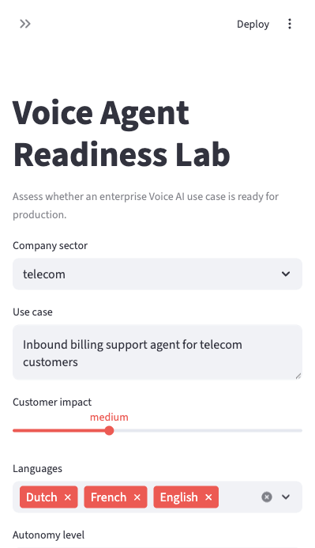
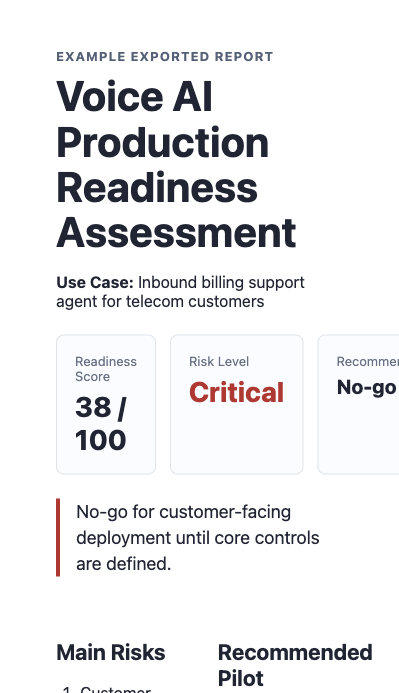

# Voice Agent Readiness Lab

**Production readiness checks for enterprise Voice AI before real customers are exposed.**

Voice AI demos beautifully. Production is a different animal: latency, escalation, compliance, language quality, CRM integration, customer frustration, hallucination, call recording, consent, authentication, fraud, and handover to humans.

Voice Agent Readiness Lab is a practical, config-driven toolkit for assessing whether a Voice AI use case is ready to operate safely, reliably, and commercially in front of customers.

## Screenshots

| App input flow | Example report output |
| --- | --- |
|  |  |

## What It Produces

Enter a use case such as `Inbound billing support agent for telecom customers` and the app generates:

- Production readiness score
- Risk classification
- Required integrations
- Human handover design
- Compliance and consent checklist
- Conversation failure modes
- Board-level questions
- Pilot design
- KPI framework
- Go / no-go recommendation
- Markdown report export

See an example exported report: [`outputs/example_telecom_billing_report.md`](outputs/example_telecom_billing_report.md).

## Who This Is For

- Executives deciding whether a Voice AI initiative is ready to scale
- Product and operations teams designing production pilots
- Advisors and consultants assessing enterprise AI risk
- Board members asking governance, accountability, and customer-impact questions
- Contact center leaders comparing use cases before vendor selection

## Example Use Cases

- Inbound customer care agent for billing questions in telecom
- Outbound appointment confirmation for hospitals
- Voice AI agent for banking card replacement
- Multilingual retail customer support agent

Sample YAML inputs are available in [`examples/`](examples/).

## Quick Start

```bash
python -m venv .venv
source .venv/bin/activate
pip install -r requirements.txt
streamlit run app.py
```

Then open the local URL shown by Streamlit, usually:

```text
http://localhost:8501
```

## Deploy On Streamlit Community Cloud

This app can be deployed directly from GitHub with Streamlit Community Cloud.

1. Go to [share.streamlit.io](https://share.streamlit.io).
2. Sign in with GitHub.
3. Click **Create app**.
4. Select this repository:

```text
matteogatta-gennoor/voice-agent-readiness-lab
```

5. Use:

```text
Branch: main
Main file path: app.py
```

6. Click **Deploy**.

After deployment, Streamlit gives you a public `streamlit.app` URL. Future `git push` updates will refresh the deployed app.

Official docs: [Deploy your app on Community Cloud](https://docs.streamlit.io/deploy/streamlit-community-cloud/deploy-your-app/deploy).

## How Scoring Works

The MVP is deterministic and config-driven. Scores are calculated from [`config/scoring_framework.yaml`](config/scoring_framework.yaml), then adjusted for sector, autonomy, compliance, authentication, integrations, fraud risk, multilingual complexity, latency, and operational readiness.

This makes the logic inspectable and easy to adapt for your own risk appetite.

## Project Structure

```text
voice-agent-readiness-lab/
  app.py
  assets/
    app-screenshot.png
    report-preview.png
  readiness/
    models.py
    scorer.py
    recommendations.py
    export.py
  config/
    scoring_framework.yaml
    sector_risks.yaml
    board_questions.yaml
    kpi_library.yaml
  examples/
    telecom_billing.yaml
    hospital_appointment.yaml
    banking_card_replacement.yaml
    retail_multilingual_support.yaml
  outputs/
    example_telecom_billing_report.md
  tests/
    test_scorer.py
```

## Current Scope

Version 1 focuses on board and pilot readiness, not vendor benchmarking. It does not claim that a specific Voice AI platform is safe. It helps teams ask the right questions before putting an agent in front of customers.

## Roadmap

- PDF export
- Optional LLM-assisted report drafting
- Industry-specific compliance modules
- Scenario testing and red-team checklists
- Batch comparison of multiple use cases
- Vendor-neutral integration readiness checklist

## License

MIT
